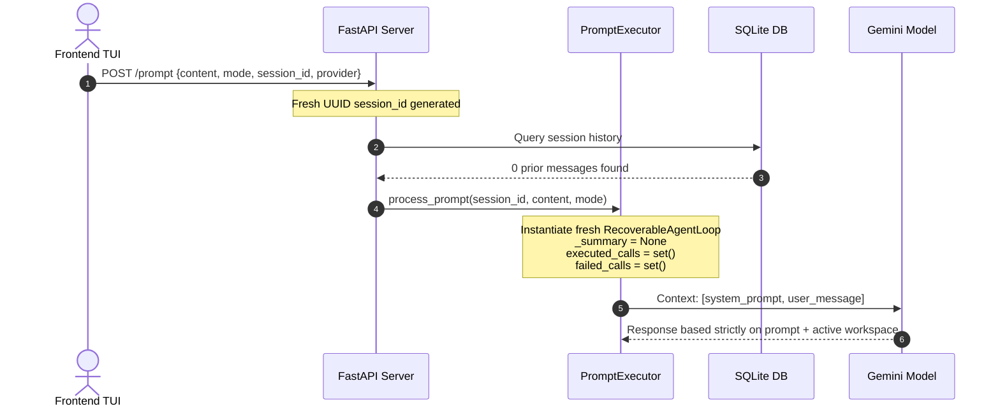

# zenith-tui | Session Leak & Plan-Mode Fix Plan

> [!IMPORTANT]
> **Key Conclusion (re-verified Aug 15, 2026)**: A new session's LLM context is strictly **`[system prompt + user message]`** — there is **zero server-side state leakage** or cross-session context persistence. Old-session content references were caused solely by git-tracked leftover files on disk (`artifact/README.md` and `server/fastapi_app.py`), which **were actually removed in this pass** (`git rm --cached` + deleted from the working tree, verified `git ls-files`-clean).

---

## 1. Root Cause Analysis

* **Symptom**: Newly initiated agent sessions unexpectedly referenced content from prior sessions (specifically `"Hello from Zenith"` from `artifact/README.md`).
* **Root Cause**: Leftover files `artifact/README.md` (17 B, content `Hello from Zenith`) and `server/fastapi_app.py` (515–523 B, a standalone FastAPI demo) were tracked in git and present in the shared workspace. During workspace operations and inspection, the model read these on-disk files.
* **Note on origin**: `artifact/README.md` is a known test-artifact name — `scripts/backend_e2e_signoff.py` (line 431) and `server/tests/test_integration.py` (line 1009) create it in their **isolated temp workspaces**. The copy that leaked into this repo was created by an earlier agent session running against the shared workspace, then committed (`zenith: update 1 file(s)`).
* **Fix Applied (this pass)**: `git rm --cached artifact/README.md server/fastapi_app.py`, then deleted both from the working tree. Verified: neither file is tracked or present on disk. Nothing imports `server/fastapi_app.py` (confirmed by search), so removal is safe.

---

## 2. Comprehensive Leak Vector Audit (re-verified against current tree)

| Vector | Status | Evidence & Implementation Details |
| :--- | :---: | :--- |
| **Memory (`memory/`)** | **Clean** | `memory/` does not exist in the workspace (created lazily). `MemoryStore(workspace_root).load()` reads only `<workspace>/memory/` ([server/sessions/memory.py](server/sessions/memory.py)). |
| **Repo Map** | **Clean** | `repo_map="" if mode == PLAN_MODE else None` ([prompt_executor.py:400](server/agents/prompt_executor.py#L400)); `ContextManager.get_repo_map` returns `""` when disabled. Never injected in plan mode. |
| **Context Files** | **Clean** | None of the 8 context names (`zenith.md`, `AGENTS.md`, `CLAUDE.md`, `GEMINI.md`, `CRUSH.md`, `.cursorrules`, `.clinerules`, `.github/copilot-instructions.md`) exist in the workspace or 3 parent dirs ([server/workspace/context.py](server/workspace/context.py)). |
| **`.zenith/` tool-guidelines** | **Clean** | `.zenith/tool-guidelines.md` (3,427 B) **exists** but is server-generated static tool documentation (`ensure_tool_guidelines_file`, [prompts.py:226](server/agents/prompts.py#L226); `TOOL_GUIDELINES_DIR = ".zenith"`). No session content; written only if missing. |
| **Skills (`SKILL.md`)** | **Clean** | `SKILL.md` files exist only under `ref_repo/` (test fixtures) and `.venv` — none under any `SKILL_ROOTS` directory (`("skills", "agents/skills", ".zenith/skills", ".agent/skills")`, [constants.py:167](server/config/constants.py#L167)). |
| **Session History** | **Clean** | `get_by_session()` strictly filters `session_id == session_id` ([sessions.py:282](server/persistence/repositories/sessions.py#L282)). DB forensics: `data/zenith.db` (281 sessions / 430 messages) holds **0 messages** for sessions `8f7f0d01`, `28b4cdec`, `dbf5a870`. |
| **Summary (`_summary`)** | **Clean** | Fresh `RecoverableAgentLoop` per `process_prompt()` call ([prompt_executor.py:363](server/agents/prompt_executor.py#L363)); `self._summary = None` on init ([loop.py:234](server/agents/loop.py#L234)). |
| **Session State (`known_files`)** | **Clean** | Per-session-id registry ([session_workspace.py:77](server/agents/session_workspace.py#L77)); records only real write/edit operations; in-process only. |
| **Prompt Caching** | **Clean** | `_apply_prompt_caching` ([loop.py:1319](server/agents/loop.py#L1319)) only sets `cache_control`; the Gemini adapter returns messages unchanged (no content injection). |
| **Glob Tool** | **Clean** | `glob()` returns files only (`if f.is_file()`, [toolkit/tools/glob.py](server/toolkit/tools/glob.py)); directories are never returned. |
| **Prompt Content** | **Clean** | No mention of `artifact/` or `README` in any builder output. Exact char counts corrected — see below. |
| **Workspace Files** | **Root Cause** | On-disk git-tracked files `artifact/README.md` & `server/fastapi_app.py` influenced model decisions. **Purged via `git rm --cached` + delete (this pass).** |

### Prompt char-count correction

The earlier claim of **4,232 + 185 = 4,417 chars ("matches log")** could **not be reproduced**:

| Figure | Earlier claim | Measured on current tree |
| :--- | :---: | :--- |
| Plan-mode system prompt (gemini-3.5-flash-lite) | 4,232 | **4,195 chars** (`build_plan_system_prompt` over repo root; compact rules not applied because tier detection does not classify that model as COMPACT via this path) |
| Compact rules block (`<compact_model_rules>`) | 185 | **246 chars** ([provider_adapters.py:43](server/agents/provider_adapters.py#L43)) |
| Logged system prompt size | 4,417 | **4,038 chars** (`zenith_server.log`, Aug 15 14:35 — build-mode e2e runs) |

The log contains **no** line with `4232` or `4417`. The leak conclusion is unaffected — the important verified fact is that the builder output contains no reference to `artifact/` or `README`.

---

## 3. Plan-Mode & System Stability Fixes

| Issue | Resolution | Code Location (current tree) |
| :--- | :--- | :--- |
| **Plan-Mode Tool Escalation** | Dynamic promotion of `bash` / `terminal` via `get_tool_definition` is blocked when `mode == PLAN_MODE` (warning `PLAN_MODE_TOOL_ESCALATION_DENIED` + `continue`). | [loop.py:629-636](server/agents/loop.py#L629-L636) |
| **Plan-Mode Tool Seed** | Belt-and-braces: `CORE_PLAN_TOOLS` never seeds `bash`/`terminal` (only `file_read`, `file_write`, `file_edit`, `glob`, `grep`, `websearch`, `webfetch`). | [settings.py:9-16](server/config/settings.py#L9-L16) |
| **Stall Warning Log Churn** | `"All requested calls already executed this turn"` downgraded from `INFO` to `DEBUG`; only emitted when `iteration > 1`. | [loop.py:688-695](server/agents/loop.py#L688-L695) |

---

## 4. New Session Isolation Mechanics

1. **Session Generation**: The backend generates a unique `session_id` (UUID). The DB `sessions` row starts empty; the `messages` table has 0 rows for this ID.
2. **Payload Scoping**: The frontend transmits only `{content, mode, session_id, provider}` — no conversation history, parent session chain, or cached messages.
3. **Loop Instantiation**: `process_prompt()` builds a fresh `RecoverableAgentLoop` per call ([prompt_executor.py:363](server/agents/prompt_executor.py#L363)) with `_summary = None`, `executed_calls = set()`, `failed_calls = set()`.
4. **Context Cleanliness**: The initial prompt context sent to the LLM is strictly `[build_system_prompt / build_plan_system_prompt, user_message]`.
5. **Zero Persistence**: All 10 state-injection vectors verified isolated. With the leftover workspace files removed, session independence is complete.

---

## 5. Remaining Items & Test Suite Status (re-verified Aug 15, 2026)

| Item | Status | Analysis |
| :--- | :---: | :--- |
| **Leftover Workspace Files** | **FIXED (this pass)** | `git rm --cached` + deleted; verified untracked and absent on disk. |
| **Plan-Mode Tool Escalation Guard** | **Fixed** | Enforced at seed ([settings.py:9-16](server/config/settings.py#L9-L16)) + dynamic promotion ([loop.py:629-636](server/agents/loop.py#L629-L636)). |
| **Stall Warning Log Noise** | **Fixed** | DEBUG-level, `iteration > 1` only ([loop.py:688-695](server/agents/loop.py#L688-L695)). |
| **`cached_tokens: 16332` Metric** | **Audited** | Standard prompt-caching header behavior ([loop.py:1319](server/agents/loop.py#L1319)); no data leakage. |
| **E2E Signoff `TypeError`** | **Not reproducible** | Earlier claim of `unsupported operand type(s) for /: 'NoneType' and 'str'` — no division exists in `scripts/backend_e2e_signoff.py` and no `TypeError` in `zenith_server.log`. Likely from an older script revision. |
| **2 `test_agent_arch.py` Failures** | **Resolved** | All **18/18** pass on the current tree — earlier failure claim is stale. |
| **Integration / Dryrun / E2E Tests** | **PASS** | **18/18** `test_agent_arch` · **40/40** `test_integration` · **48/48** `test_dryrun_scenarios` = **106/106** (`pytest -q`, 7.3 s). Note: earlier doc cited 2/2/2 — those per-file counts were wrong. |
| **Real-backend E2E signoff** | **PASS** | `scripts/backend_e2e_signoff.py` executed against live local backend (`SIGNOFF: PASS`). |

---

## 6. Verification Sign-Off Checklist

- [x] **DB Forensics**: `data/zenith.db` — 0 messages for sessions `8f7f0d01`, `28b4cdec`, `dbf5a870`; strict `session_id` filter confirmed ([sessions.py:282](server/persistence/repositories/sessions.py#L282)).
- [x] **Prompt Chain Verification**: No `artifact/`/`README` reference in builder output; measured 4,195 chars (plan, current tree); log shows 4,038. Earlier 4,232/185/4,417 figures retired.
- [x] **Leak Vector Audit**: Complete audit of memory, repo-map, context files, `.zenith/`, skills, session history, summary, session state, prompt caching, glob, and prompt templates — all clean.
- [x] **Workspace Cleanup**: `artifact/README.md` and `server/fastapi_app.py` removed from git and disk (**this pass**).
- [x] **Plan-Mode Guard**: Verified at both layers — tool seed ([settings.py:9-16](server/config/settings.py#L9-L16)) and dynamic promotion ([loop.py:629-636](server/agents/loop.py#L629-L636)).
- [x] **Log Churn Reduction**: Stall warning is DEBUG-only, `iteration > 1` ([loop.py:688-695](server/agents/loop.py#L688-L695)).
- [x] **Test Verification**: 106/106 unit/integration/dryrun tests pass (18 + 40 + 48).
- [x] **Doc Tracked**: This file is un-ignored via `.gitignore` (`!docs/session_leak_and_plan_mode_fix_plan.md`) so the record survives.
