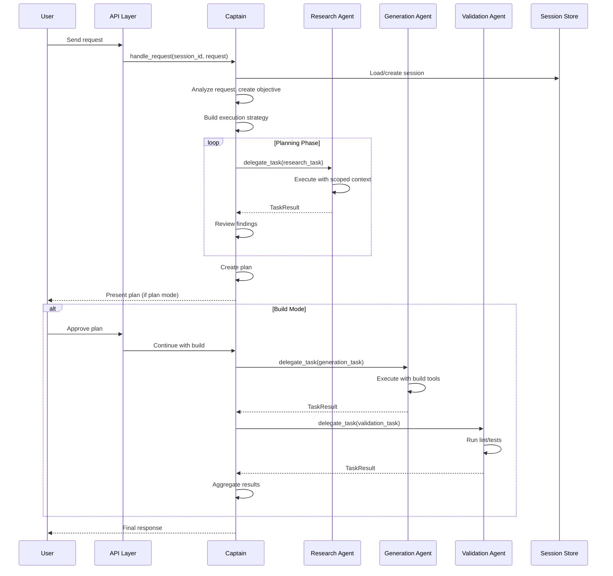

# Detailed Design — Multi-Agent Orchestration

**Date**: 2026-08-02  
**Version**: 1.0  

---

## Table of Contents

1. [System Architecture](#1-system-architecture)
2. [Backend Design](#2-backend-design)
3. [Frontend Design](#3-frontend-design)
4. [Execution Flow](#4-execution-flow)
5. [State Management](#5-state-management)
6. [Failure Handling](#6-failure-handling)
7. [Observability](#7-observability)
8. [Extensibility](#8-extensibility)

---

## 1. System Architecture

### 1.1 Captain Agent

The **Captain Agent** is the single orchestrator and the only agent that communicates with the user.

#### Responsibilities

- Receive and normalize user requests
- Understand goals, constraints, and success criteria
- Create execution strategies and plans
- Decompose work into tasks
- Select and assign Crew Agents
- Monitor agent progress
- Manage retries, failures, and escalations
- Aggregate and resolve conflicting results
- Present unified, concise responses to the user

#### Design Principle

The Captain Agent should **never perform specialized work directly** unless there is no alternative. It delegates all domain-specific work to Crew Agents.

#### State Lifecycle

```
Idle → Planning → Delegating → Monitoring → Reviewing → Completed/Failed
```

### 1.2 Crew Agents

Crew Agents are specialized workers that operate in isolation.

#### Design Principle

Each Crew Agent should:
- Receive only the context required for its assigned task
- Work exclusively within its assigned scope
- Produce a structured result
- Never communicate with other Crew Agents
- Never modify another agent's state
- Never make orchestration decisions

#### Agent Types (Examples)

| Agent Type | Responsibility |
|------------|---------------|
| `research` | Codebase search, documentation lookup, web research |
| `analysis` | Code analysis, architecture review, dependency mapping |
| `generation` | Code generation, file creation |
| `refactoring` | Code restructuring, optimization |
| `testing` | Test creation, test execution, coverage analysis |
| `debugging` | Bug investigation, fix proposals |
| `documentation` | Doc generation, README updates |
| `security` | Security review, vulnerability analysis |
| `performance` | Performance profiling, optimization |
| `git` | Git operations, branching, commits |
| `terminal` | Shell command execution |
| `validation` | Linting, type checking, build verification |

#### Task Contract

Each Crew Agent receives a **TaskSpec**:

```python
@dataclass
class TaskSpec:
    task_id: str
    parent_session_id: str
    objective: str
    allowed_tools: list[str]
    allowed_mcp: dict[str, list[str]] | None
    repo_scope: list[str]  # Files/directories this agent can access
    context: str  # Minimal context: summary, prior findings, relevant snippets
    output_schema: dict  # Expected result structure
    deadline: float | None  # Optional timeout in seconds
    retry_policy: RetryPolicy
```

And returns a **TaskResult**:

```python
@dataclass
class TaskResult:
    task_id: str
    agent_id: str
    status: TaskStatus  # pending, running, completed, failed, cancelled
    summary: str
    findings: dict
    artifacts: list[Artifact]  # Files, diffs, reports
    confidence: float  # 0.0 to 1.0
    metrics: dict  # Tokens, duration, tool calls
    errors: list[str]
    suggestions: list[str]
```

### 1.3 Communication Model

All communication follows this pattern:

```
User
   ↓
Captain Agent
   ↓
Crew Agent(s)
   ↓
Captain Agent
   ↓
User
```

**Prohibited Communication**:
- Crew Agent → User (never)
- Crew Agent → Crew Agent (never)
- Crew Agent → Orchestration logic (never)

All communication is mediated by the Captain Agent through the event bus.

---

## 2. Backend Design

### 2.1 Component Overview

```
┌─────────────────────────────────────────────────────────────┐
│                        API Layer                             │
│  (WebSocket handlers, RPC dispatch, session management)      │
└─────────────────────────────────────────────────────────────┘
                              │
                              ▼
┌─────────────────────────────────────────────────────────────┐
│                   Captain Orchestrator                       │
│  - Task graph management                                     │
│  - Agent selection and delegation                            │
│  - State machine coordination                                │
│  - Retry and recovery logic                                  │
└─────────────────────────────────────────────────────────────┘
                              │
              ┌───────────────┼───────────────┐
              ▼               ▼               ▼
┌──────────────────┐ ┌──────────────────┐ ┌──────────────────┐
│   Agent Runtime  │ │   Agent Runtime  │ │   Agent Runtime  │
│   (Research)     │ │   (Generation)   │ │   (Validation)   │
└──────────────────┘ └──────────────────┘ └──────────────────┘
              │               │               │
              └───────────────┼───────────────┘
                              ▼
┌─────────────────────────────────────────────────────────────┐
│                     Shared Services                          │
│  - Context manager (scoped context builder)                  │
│  - Tool registry (tool execution, permissions)               │
│  - Event bus (lifecycle, progress, errors)                   │
│  - Persistence (sessions, tasks, checkpoints)                │
└─────────────────────────────────────────────────────────────┘
```

### 2.2 Core Services

#### 2.2.1 Captain Orchestrator Service

**File**: `server/agents/captain.py`

```python
class CaptainOrchestrator:
    """Central orchestrator for multi-agent execution."""
    
    def __init__(
        self,
        session_repo: SessionRepository,
        task_repo: TaskRepository,
        agent_registry: AgentRegistry,
        event_bus: EventBus,
        context_builder: ContextBuilder,
    ):
        self._sessions = session_repo
        self._tasks = task_repo
        self._agents = agent_registry
        self._events = event_bus
        self._context = context_builder
        self._state: CaptainState = CaptainState.IDLE
        self._task_graph: TaskGraph = TaskGraph()
    
    async def handle_request(
        self,
        session_id: str,
        user_request: str,
        mode: str = "build",
    ) -> AsyncIterator[OrchestrationEvent]:
        """Main entry point for user requests."""
        # 1. Normalize request and create objective
        # 2. Build execution strategy
        # 3. Decompose into tasks
        # 4. Select agents and assign work
        # 5. Monitor execution
        # 6. Aggregate and synthesize results
        # 7. Yield final response
        ...
    
    async def delegate_task(
        self,
        task: TaskSpec,
        agent_type: str,
    ) -> TaskResult:
        """Delegate a task to a specific agent type."""
        ...
    
    async def handle_agent_result(
        self,
        result: TaskResult,
    ) -> OrchestrationDecision:
        """Process agent result and decide next action."""
        # Returns: PROCEED, RETRY, ESCALATE, REQUEST_CLARIFICATION
        ...
```

#### 2.2.2 Agent Registry

**File**: `server/agents/registry.py`

```python
class AgentRegistry:
    """Registry of available Crew Agent types."""
    
    def __init__(self, config: AppSettings, tool_registry: ToolRegistry):
        self._config = config
        self._tools = tool_registry
        self._agent_types: dict[str, type[CrewAgent]] = {}
    
    def register(self, agent_type: str, agent_class: type[CrewAgent]) -> None:
        """Register a new agent type."""
        self._agent_types[agent_type] = agent_class
    
    def create(
        self,
        agent_type: str,
        provider: BaseProvider,
        context: AgentContext,
    ) -> CrewAgent:
        """Create an instance of the specified agent type."""
        ...
```

#### 2.2.3 Crew Agent Runtime

**File**: `server/agents/crew.py`

```python
class CrewAgent(ABC):
    """Abstract base class for Crew Agents."""
    
    @abstractmethod
    async def execute(
        self,
        task: TaskSpec,
        provider: BaseProvider,
    ) -> TaskResult:
        """Execute the assigned task and return results."""
        ...
    
    @abstractmethod
    def allowed_tools(self) -> list[str]:
        """Return the list of tools this agent can use."""
        ...
```

Each Crew Agent wraps the existing `AgentLoop` but with:
- Scoped context (limited repo access)
- Restricted tool set
- Isolated state (fresh child session)
- Structured output schema

#### 2.2.4 Context Builder

**File**: `server/agents/context_builder.py`

```python
class ContextBuilder:
    """Builds minimal, scoped context for each task."""
    
    async def build_context(
        self,
        session_id: str,
        task: TaskSpec,
        prior_results: list[TaskResult],
    ) -> str:
        """
        Build a minimal context payload containing:
        - Task objective
        - Relevant code snippets (based on repo_scope)
        - Prior findings from parent/peer tasks
        - Repo map subset (if needed)
        - Session summary
        """
        ...
```

This enforces isolation and reduces token costs by avoiding full-repo context.

#### 2.2.5 Task Graph

**File**: `server/agents/task_graph.py`

```python
class TaskGraph:
    """Dependency-aware task scheduling."""
    
    def __init__(self):
        self._tasks: dict[str, TaskSpec] = {}
        self._dependencies: dict[str, set[str]] = {}
        self._results: dict[str, TaskResult] = {}
    
    def add_task(
        self,
        task: TaskSpec,
        depends_on: list[str] | None = None,
    ) -> None:
        """Add a task with optional dependencies."""
        ...
    
    def ready_tasks(self) -> list[TaskSpec]:
        """Return tasks that are ready to execute (dependencies satisfied)."""
        ...
    
    def mark_complete(self, task_id: str, result: TaskResult) -> None:
        """Mark a task as complete and update dependents."""
        ...
```

### 2.3 Event Schema

**File**: `server/domain/orchestration_events.py`

```python
class OrchestrationEventKind(StrEnum):
    # Captain lifecycle
    CAPTAIN_REQUEST_RECEIVED = "captain_request_received"
    CAPTAIN_PLANNING_STARTED = "captain_planning_started"
    CAPTAIN_PLAN_CREATED = "captain_plan_created"
    CAPTAIN_DELEGATION_STARTED = "captain_delegation_started"
    CAPTAIN_REVIEWING = "captain_reviewing"
    CAPTAIN_DECISION_MADE = "captain_decision_made"
    CAPTAIN_COMPLETED = "captain_completed"
    CAPTAIN_FAILED = "captain_failed"
    
    # Crew lifecycle
    CREW_TASK_ASSIGNED = "crew_task_assigned"
    CREW_STARTED = "crew_started"
    CREW_PROGRESS = "crew_progress"
    CREW_WAITING = "crew_waiting"
    CREW_COMPLETED = "crew_completed"
    CREW_FAILED = "crew_failed"
    CREW_CANCELLED = "crew_cancelled"
    
    # Orchestration
    TASK_CREATED = "task_created"
    TASK_RETRY = "task_retry"
    TASK_ESCALATION = "task_escalation"
    VALIDATION_CHECK = "validation_check"
    CONFLICT_DETECTED = "conflict_detected"
```

### 2.4 Persistence

#### Task Repository

**File**: `server/persistence/task_repository.py`

```python
class TaskRepository:
    """Persistent storage for task definitions and results."""
    
    async def create(self, task: TaskSpec) -> TaskSpec: ...
    async def get(self, task_id: str) -> TaskSpec | None: ...
    async def update(self, task: TaskSpec) -> None: ...
    async def list_by_session(self, session_id: str) -> list[TaskSpec]: ...
    async def save_result(self, result: TaskResult) -> None: ...
```

#### Checkpoint Store

**File**: `server/persistence/checkpoint.py`

```python
class CheckpointStore:
    """Execution checkpoints for recovery."""
    
    async def save_checkpoint(
        self,
        session_id: str,
        task_graph: TaskGraph,
        state: CaptainState,
    ) -> str:
        """Save execution state for later recovery."""
        ...
    
    async def load_checkpoint(
        self,
        checkpoint_id: str,
    ) -> tuple[TaskGraph, CaptainState]:
        """Load a previous checkpoint."""
        ...
```

---

## 3. Frontend Design

### 3.1 Layout Overview

```
┌─────────────────────────────────────────────────────────────┐
│  Session Status Bar (provider, model, tokens, mode)         │
├─────────────────────────────────────────────────────────────┤
│                                                             │
│  ┌───────────────────────────────────────────────────────┐  │
│  │              Conversation / Output Panel               │  │
│  │  (User messages, agent responses, plan output)         │  │
│  └───────────────────────────────────────────────────────┘  │
│                                                             │
├─────────────────────────────────────────────────────────────┤
│  ┌───────────────────────────────────────────────────────┐  │
│  │              Captain Dashboard (Collapsible)           │  │
│  │  Objective: ...                                        │  │
│  │  Strategy: ...                                         │  │
│  │  Progress: [████████░░] 80%                            │  │
│  │  Active: 2 | Pending: 3 | Blocked: 0 | Retries: 1     │  │
│  └───────────────────────────────────────────────────────┘  │
│                                                             │
├─────────────────────────────────────────────────────────────┤
│  ┌─────────────┐  ┌─────────────┐  ┌─────────────┐         │
│  │ Crew Agent  │  │ Crew Agent  │  │ Crew Agent  │         │
│  │   Card 1    │  │   Card 2    │  │   Card 3    │         │
│  └─────────────┘  └─────────────┘  └─────────────┘         │
│                                                             │
├─────────────────────────────────────────────────────────────┤
│  ┌───────────────────────────────────────────────────────┐  │
│  │              Timeline (Expandable)                     │  │
│  │  08:45:12  Captain: Planning started                   │  │
│  │  08:45:15  Captain: Plan created                       │  │
│  │  08:45:16  Research Agent: Task assigned               │  │
│  │  08:45:18  Research Agent: Running...                  │  │
│  │  08:45:42  Research Agent: Completed                   │  │
│  └───────────────────────────────────────────────────────┘  │
│                                                             │
├─────────────────────────────────────────────────────────────┤
│  Input: [________________________________________] [Send]   │
└─────────────────────────────────────────────────────────────┘
```

### 3.2 Captain Dashboard

**File**: `tui/src/components/Display/CaptainDashboard.tsx`

The Captain Dashboard shows:
- Current objective (user request summary)
- Execution strategy (plan/build, parallel/sequential)
- Overall progress bar
- Active agent count
- Pending tasks
- Blocked tasks
- Retry attempts
- Current decision (if Captain is reviewing)

### 3.3 Crew Agent Cards

**File**: `tui/src/components/Display/CrewAgentCard.tsx`

Each Crew Agent Card displays:
- Agent name and type
- Current task (objective summary)
- Status (idle, running, waiting, completed, failed)
- Progress indicator (if applicable)
- Duration elapsed
- Output summary (truncated)
- Errors (if any)
- Expandable log section

### 3.4 Timeline

**File**: `tui/src/components/Display/OrchestrationTimeline.tsx`

Real-time event timeline with:
- Timestamps
- Event kind (Captain, Crew, Orchestration)
- Status indicators (● running, ✓ completed, ✗ failed)
- Collapsible event groups

### 3.5 Activity Panel

**File**: `tui/src/components/Display/ActivityPanel.tsx`

Expandable panel for detailed inspection:
- Task delegation events
- Agent lifecycle transitions
- Tool invocations
- Validation steps
- Decision logs
- Error traces

### 3.6 Calm vs Detailed Mode

#### Calm Mode
- Hide orchestration dashboard
- Hide agent cards
- Hide timeline
- Show only:
  - Conversation
  - High-level progress indicator
  - Final result

#### Detailed Mode
- Show all orchestration elements
- Real-time updates
- Expandable panels
- Full event history

**Implementation**: Use a mode toggle in the TUI that sets a `detailedMode` boolean in the app state.

---

## 4. Execution Flow

### 4.1 Request Lifecycle



### 4.2 Task Delegation

1. Captain creates `TaskSpec` with:
   - Objective
   - Scope
   - Allowed tools
   - Output schema
   - Retry policy

2. Captain selects agent type from registry

3. Agent runtime is created with:
   - Fresh or child session
   - Scoped context
   - Restricted tool registry

4. Agent executes and yields events

5. Captain receives `TaskResult` and decides:
   - **PROCEED**: Mark task complete, continue with next
   - **RETRY**: Re-delegate with mutated context
   - **ESCALATE**: Ask user for clarification
   - **FAIL**: Mark task failed, handle gracefully

### 4.3 Plan/Build Handoff

**Current implementation** (in `server/agents/prompt_executor.py`):
- Plan mode produces output
- Plan is stored in session
- User approves
- Build mode spawns fresh sub-agent with plan as input

**Extension**:
- Captain orchestrates the handoff
- Plan is structured (not free-form text)
- Build tasks are derived from plan sections
- Validation gates between phases

---

## 5. State Management

### 5.1 Session State

**Current**: `server/domain/session.py` defines `SessionState` enum

**Extension**: Add orchestration-specific state:

```python
class SessionState(StrEnum):
    CREATED = "created"
    ACTIVE = "active"
    PLANNING = "planning"          # Captain is planning
    AWAITING_APPROVAL = "awaiting_approval"  # Plan pending user approval
    BUILDING = "building"          # Build mode executing
    COMPLETED = "completed"
    FAILED = "failed"
    CANCELLED = "cancelled"
```

### 5.2 Task State

```python
class TaskState(StrEnum):
    PENDING = "pending"          # Created, not yet started
    QUEUED = "queued"            # Ready to execute
    RUNNING = "running"          # Currently executing
    WAITING = "waiting"          # Blocked on dependency
    RETRYING = "retrying"        # Retry in progress
    COMPLETED = "completed"      # Successfully finished
    FAILED = "failed"            # Failed after retries
    CANCELLED = "cancelled"      # Cancelled by user or orchestrator
```

### 5.3 Captain State

```python
class CaptainState(StrEnum):
    IDLE = "idle"
    ANALYZING = "analyzing"      # Processing user request
    PLANNING = "planning"        # Creating execution plan
    DELEGATING = "delegating"    # Assigning tasks to agents
    MONITORING = "monitoring"    # Waiting for agent results
    REVIEWING = "reviewing"      # Reviewing agent outputs
    RETRYING = "retrying"        # Handling retry logic
    ESCALATING = "escalating"    # Requesting user input
    COMPLETED = "completed"      # All work finished
    FAILED = "failed"            # Unrecoverable failure
```

### 5.4 State Transitions

All state transitions are:
- Explicit (method calls, not implicit)
- Logged (with timestamp and reason)
- Persisted (in session/task metadata)
- Streamed (as events to frontend)

---

## 6. Failure Handling

### 6.1 Retry Policy

```python
@dataclass
class RetryPolicy:
    max_attempts: int = 3
    backoff_base: float = 1.0
    backoff_multiplier: float = 2.0
    max_backoff: float = 60.0
    mutate_context: bool = True  # Modify context on each retry
```

### 6.2 Failure Isolation

- Each Crew Agent runs in isolated session
- Failures in one agent do not corrupt another agent's state
- Captain maintains failure list and decides whether to:
  - Retry the same task
  - Skip the task
  - Mark the whole objective as failed

### 6.3 Recovery

- Checkpoints saved at major milestones
- On restart/retry, Captain can load checkpoint and resume
- Summary snapshots preserve key findings even if full state is lost

### 6.4 Graceful Degradation

If optional agents (e.g., performance, security) fail:
- Continue with core agents
- Note degraded mode in final response
- User can request explicit re-run for those aspects

---

## 7. Observability

### 7.1 Event Logging

All orchestration events are logged to:
- Structured log file (JSON)
- Database (session metadata)
- Event stream (WebSocket to frontend)

### 7.2 Metrics

Track per-session:
- Total tokens used
- Duration per phase
- Agent invocations
- Retry count
- Tool usage

Track per-task:
- Input tokens
- Output tokens
- Duration
- Success/failure
- Retry attempts

### 7.3 Diagnostics

Debug capabilities:
- Task graph visualization (in logs)
- State transition history
- Full event replay
- Agent context inspection (for debugging only)

---

## 8. Extensibility

### 8.1 Adding New Agent Types

1. Create a new class implementing `CrewAgent`
2. Register in `AgentRegistry`
3. Add agent type to configuration if needed
4. No changes to orchestrator required

### 8.2 Adding New Tools

1. Create tool implementing `BaseTool`
2. Register in `ToolRegistry`
3. Add to agent allowlists as needed

### 8.3 Adding New Modes

1. Define mode configuration in `settings.py`
2. Add mode-specific logic in orchestrator
3. Add UI support in TUI

---

## 9. File Structure

### New Backend Files

```
server/
├── agents/
│   ├── captain.py              # Captain orchestrator
│   ├── registry.py             # Agent registry
│   ├── crew.py                 # Crew agent base class
│   ├── task_graph.py           # Task dependency management
│   └── context_builder.py      # Scoped context construction
├── domain/
│   └── orchestration_events.py # Orchestration event types
├── persistence/
│   ├── task_repository.py      # Task persistence
│   └── checkpoint.py           # Checkpoint storage
```

### New Frontend Files

```
tui/src/
├── components/Display/
│   ├── CaptainDashboard.tsx    # Captain orchestrator view
│   ├── CrewAgentCard.tsx       # Agent status card
│   ├── OrchestrationTimeline.tsx # Event timeline
│   └── ActivityPanel.tsx       # Detailed activity log
├── hooks/
│   └── useOrchestration.ts     # Orchestration state hook
└── types/
    └── orchestration.ts        # Orchestration types
```

---

## 10. Integration Points

### Existing Code to Modify

| File | Modification |
|------|--------------|
| `server/agents/coordinator.py` | Delegate to Captain Orchestrator |
| `server/agents/prompt_executor.py` | Route through Captain |
| `server/domain/events.py` | Add orchestration events |
| `server/domain/session.py` | Add orchestration states |
| `server/api/handlers.py` | Add orchestration RPC methods |
| `tui/src/App.tsx` | Add dashboard and agent cards |
| `tui/src/hooks/useConversation.ts` | Handle orchestration events |

### New RPC Methods

```python
# Orchestration-specific endpoints
"orchestration.status"     # Get current orchestration state
"orchestration.timeline"   # Get event timeline
"orchestration.cancel"     # Cancel current task
"orchestration.retry"      # Retry failed task
```

---

## 11. Testing Strategy

### Unit Tests

- Captain state transitions
- Task graph scheduling
- Retry logic
- Context building
- Event emission

### Integration Tests

- Plan → Build handoff
- Agent delegation
- Recovery from checkpoints
- Multi-agent coordination

### E2E Tests

- Full user request → response cycle
- Plan mode with approval
- Build mode with validation
- Failure and retry scenarios

---

## 12. Migration Path

### Phase 1: Foundation (Non-Breaking)

1. Add orchestration types and events
2. Add task repository and checkpoint store
3. Add Captain Orchestrator (behind feature flag)
4. Run existing flows through Captain as pass-through

### Phase 2: Activation

1. Enable Captain for new sessions
2. Add Crew Agent registry
3. Implement task graph scheduling
4. Extend TUI with dashboard

### Phase 3: Hardening

1. Add validation gates
2. Implement recovery
3. Add metrics and observability
4. Performance optimization

---

## Summary

This design provides a production-ready multi-agent orchestration layer that:
- Preserves the existing architecture
- Adds explicit state management
- Enables transparent execution
- Supports calm and detailed modes
- Is extensible for future agent types
- Is resilient to failures

The key principle is: **single orchestrator, isolated workers, event-driven state**.
