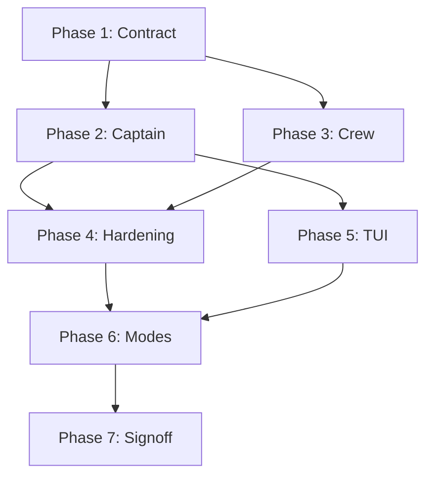

# Implementation Todo List — Multi-Agent Orchestration

**Date**: 2026-08-02  
**Version**: 1.0  

---

## Phase 1: Orchestration Contract & Event Schema

**Goal**: Define the types, events, and contracts that all components will use.

### 1.1 Core Types

- [ ] Create `server/domain/orchestration_types.py`
  - [ ] `TaskSpec` dataclass
  - [ ] `TaskResult` dataclass
  - [ ] `TaskState` enum
  - [ ] `CaptainState` enum
  - [ ] `RetryPolicy` dataclass
  - [ ] `OrchestrationDecision` enum

### 1.2 Event Schema

- [ ] Create `server/domain/orchestration_events.py`
  - [ ] `OrchestrationEventKind` enum
  - [ ] `OrchestrationEvent` dataclass
  - [ ] Event validation helpers

### 1.3 Persistence Schema

- [ ] Create database migration for tasks table
  - [ ] `tasks` table with columns: id, session_id, parent_task_id, state, spec, result, created_at, updated_at
  - [ ] `checkpoints` table for recovery state
- [ ] Create `server/persistence/task_repository.py`
  - [ ] `create(task: TaskSpec) -> TaskSpec`
  - [ ] `get(task_id: str) -> TaskSpec | None`
  - [ ] `update(task: TaskSpec) -> None`
  - [ ] `list_by_session(session_id: str) -> list[TaskSpec]`
  - [ ] `save_result(task_id: str, result: TaskResult) -> None`
- [ ] Create `server/persistence/checkpoint.py`
  - [ ] `save_checkpoint(session_id, task_graph, state) -> checkpoint_id`
  - [ ] `load_checkpoint(checkpoint_id) -> (task_graph, state)`

### 1.4 Tests

- [ ] Unit tests for `TaskSpec` validation
- [ ] Unit tests for `TaskResult` serialization
- [ ] Unit tests for event emission
- [ ] Unit tests for task repository CRUD

---

## Phase 2: Captain Orchestrator Service

**Goal**: Build the central orchestration service that coordinates all agent work.

### 2.1 Captain Orchestrator

- [ ] Create `server/agents/captain.py`
  - [ ] `CaptainOrchestrator` class
  - [ ] `handle_request(session_id, user_request, mode) -> AsyncIterator[OrchestrationEvent]`
  - [ ] `_analyze_request(request) -> Objective`
  - [ ] `_build_strategy(objective, mode) -> ExecutionStrategy`
  - [ ] `_decompose_tasks(strategy) -> list[TaskSpec]`
  - [ ] `_select_agent(task) -> agent_type`
  - [ ] `delegate_task(task, agent_type) -> TaskResult`
  - [ ] `handle_agent_result(result) -> OrchestrationDecision`
  - [ ] `_synthesize_results(results) -> FinalResponse`

### 2.2 Task Graph

- [ ] Create `server/agents/task_graph.py`
  - [ ] `TaskGraph` class with dependency management
  - [ ] `add_task(task, depends_on)`
  - [ ] `ready_tasks() -> list[TaskSpec]`
  - [ ] `mark_complete(task_id, result)`
  - [ ] `mark_failed(task_id, error)`
  - [ ] `get_dependents(task_id) -> list[TaskSpec]`

### 2.3 Context Builder

- [ ] Create `server/agents/context_builder.py`
  - [ ] `ContextBuilder` class
  - [ ] `build_context(session_id, task, prior_results) -> str`
  - [ ] `_extract_relevant_snippets(repo_scope) -> str`
  - [ ] `_format_prior_findings(results) -> str`

### 2.4 Integration

- [ ] Modify `server/agents/coordinator.py` to delegate to Captain
- [ ] Modify `server/agents/prompt_executor.py` to route through Captain
- [ ] Add feature flag `ZENITH_USE_CAPTAIN` for gradual rollout

### 2.5 Tests

- [ ] Unit tests for Captain state transitions
- [ ] Unit tests for task decomposition
- [ ] Unit tests for decision logic (PROCEED/RETRY/ESCALATE)
- [ ] Integration test: simple request → plan → response
- [ ] Integration test: request with retry

---

## Phase 3: Crew Agent Registry & Runtime

**Goal**: Create the agent registry and worker runtime that executes tasks.

### 3.1 Crew Agent Base

- [ ] Create `server/agents/crew.py`
  - [ ] `CrewAgent` abstract base class
  - [ ] `execute(task, provider) -> TaskResult`
  - [ ] `allowed_tools() -> list[str]`

### 3.2 Agent Registry

- [ ] Create `server/agents/registry.py`
  - [ ] `AgentRegistry` class
  - [ ] `register(agent_type, agent_class)`
  - [ ] `create(agent_type, provider, context) -> CrewAgent`
  - [ ] `list_types() -> list[str]`

### 3.3 Built-in Crew Agents

- [ ] Create `server/agents/crew/` package
  - [ ] `research.py` — ResearchAgent (search, grep, webfetch)
  - [ ] `analysis.py` — AnalysisAgent (code analysis, architecture)
  - [ ] `generation.py` — GenerationAgent (file creation, edits)
  - [ ] `validation.py` — ValidationAgent (lint, test, typecheck)
  - [ ] `git.py` — GitAgent (git operations)
  - [ ] `terminal.py` — TerminalAgent (bash commands)

### 3.4 Integration

- [ ] Register all built-in agents at startup
- [ ] Wire registry into Captain Orchestrator
- [ ] Extend `AgentLoop` to support task-scoped execution

### 3.5 Tests

- [ ] Unit tests for agent registry
- [ ] Unit tests for each built-in agent type
- [ ] Integration test: Captain → ResearchAgent → result
- [ ] Integration test: Captain → GenerationAgent → validation

---

## Phase 4: Execution Hardening & Recovery

**Goal**: Add retry policies, failure isolation, and recovery mechanisms.

### 4.1 Retry Logic

- [ ] Implement retry policy in `CaptainOrchestrator`
  - [ ] Exponential backoff
  - [ ] Context mutation on retry
  - [ ] Retry attempt tracking
  - [ ] Max attempts enforcement

### 4.2 Failure Isolation

- [ ] Ensure each Crew Agent runs in isolated session
- [ ] Add error boundary around agent execution
- [ ] Implement graceful failure reporting

### 4.3 Recovery

- [ ] Implement checkpoint saving at milestones
  - [ ] After plan creation
  - [ ] After each task completion
  - [ ] After validation
- [ ] Implement recovery from checkpoint
  - [ ] Load task graph state
  - [ ] Resume from last successful task
  - [ ] Skip already-completed work

### 4.4 Cancellation

- [ ] Implement task cancellation
  - [ ] Cancel in-flight agent execution
  - [ ] Cancel pending tasks
  - [ ] Handle partial results

### 4.5 Tests

- [ ] Unit tests for retry logic
- [ ] Unit tests for checkpoint save/load
- [ ] Integration test: failure → retry → success
- [ ] Integration test: checkpoint → restart → resume

---

## Phase 5: TUI Dashboard & Agent Cards

**Goal**: Build the frontend components that display orchestration state.

### 5.1 Types & Hooks

- [ ] Create `tui/src/types/orchestration.ts`
  - [ ] TypeScript interfaces matching backend types
- [ ] Create `tui/src/hooks/useOrchestration.ts`
  - [ ] Subscribe to orchestration events
  - [ ] Maintain current state
  - [ ] Provide timeline data

### 5.2 Captain Dashboard

- [ ] Create `tui/src/components/Display/CaptainDashboard.tsx`
  - [ ] Objective display
  - [ ] Strategy indicator
  - [ ] Progress bar
  - [ ] Active/Pending/Blocked/Retry counts
  - [ ] Current decision display

### 5.3 Crew Agent Cards

- [ ] Create `tui/src/components/Display/CrewAgentCard.tsx`
  - [ ] Agent name and type
  - [ ] Current task
  - [ ] Status indicator
  - [ ] Progress
  - [ ] Duration
  - [ ] Output summary (collapsible)
  - [ ] Error display

### 5.4 Timeline

- [ ] Create `tui/src/components/Display/OrchestrationTimeline.tsx`
  - [ ] Event list with timestamps
  - [ ] Status icons
  - [ ] Collapsible event groups

### 5.5 Activity Panel

- [ ] Create `tui/src/components/Display/ActivityPanel.tsx`
  - [ ] Task delegation events
  - [ ] Tool invocations
  - [ ] Validation steps
  - [ ] Decision logs
  - [ ] Expandable sections

### 5.6 Integration

- [ ] Modify `tui/src/App.tsx` to include dashboard and cards
- [ ] Update event handling in `useConversation.ts`
- [ ] Add RPC client methods for orchestration endpoints

### 5.7 Tests

- [ ] Component tests for CaptainDashboard
- [ ] Component tests for CrewAgentCard
- [ ] Component tests for Timeline
- [ ] Integration test: event stream → UI update

---

## Phase 6: Calm & Detailed Mode

**Goal**: Implement the two presentation modes for different user preferences.

### 6.1 Mode Toggle

- [ ] Add `detailedMode` to app state
- [ ] Create mode toggle UI element
- [ ] Persist mode preference in session

### 6.2 Calm Mode

- [ ] Hide Captain Dashboard
- [ ] Hide Crew Agent Cards
- [ ] Hide Timeline
- [ ] Show only conversation and high-level progress

### 6.3 Detailed Mode

- [ ] Show all orchestration elements
- [ ] Enable real-time updates
- [ ] Enable expandable panels

### 6.4 Tests

- [ ] Component tests for mode toggle
- [ ] Visual test: calm mode vs detailed mode

---

## Phase 7: Validation & Signoff

**Goal**: Verify the implementation meets all requirements.

### 7.1 End-to-End Testing

- [ ] Plan mode: request → plan → approval flow
- [ ] Build mode: approved plan → execution → validation
- [ ] Retry scenario: failure → retry → success
- [ ] Cancellation scenario: cancel mid-execution
- [ ] Recovery scenario: checkpoint → restart → resume
- [ ] Multi-agent scenario: parallel agent execution

### 7.2 Performance Testing

- [ ] Measure token overhead of orchestration layer
- [ ] Measure latency of event emission
- [ ] Verify no blocking in async paths

### 7.3 Regression Testing

- [ ] Run all existing tests
- [ ] Verify no change in agent loop behavior (without Captain)
- [ ] Verify backward compatibility with existing sessions

### 7.4 Documentation

- [ ] Update `README.md` with orchestration architecture
- [ ] Add developer guide for adding new Crew Agents
- [ ] Add user guide for calm/detailed modes

---

## Progress Tracking

| Phase | Status | Completion |
|-------|--------|------------|
| Phase 1: Orchestration Contract | Not Started | 0% |
| Phase 2: Captain Orchestrator | Not Started | 0% |
| Phase 3: Crew Agent Registry | Not Started | 0% |
| Phase 4: Execution Hardening | Not Started | 0% |
| Phase 5: TUI Dashboard | Not Started | 0% |
| Phase 6: Calm/Detailed Mode | Not Started | 0% |
| Phase 7: Validation & Signoff | Not Started | 0% |

---

## Dependencies

---

## Estimated Effort

| Phase | Estimated Time |
|-------|----------------|
| Phase 1 | 2-3 days |
| Phase 2 | 3-4 days |
| Phase 3 | 2-3 days |
| Phase 4 | 2-3 days |
| Phase 5 | 3-4 days |
| Phase 6 | 1-2 days |
| Phase 7 | 2-3 days |
| **Total** | **15-22 days** |

---

## Notes

- Each phase should be completed and tested before moving to the next
- Feature flags allow incremental rollout without breaking existing behavior
- Tests should be written alongside implementation, not after
